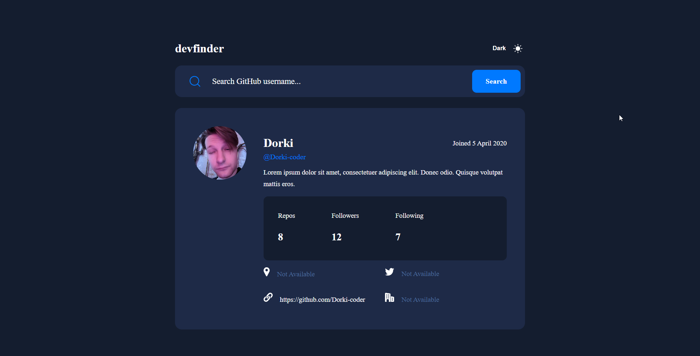

# Frontend Mentor - GitHub user search app solution

This is a solution to the [GitHub user search app challenge on Frontend Mentor](https://www.frontendmentor.io/challenges/github-user-search-app-Q09YOgaH6). Frontend Mentor challenges help you improve your coding skills by building realistic projects.

## Table of contents

- [Overview](#overview)
  - [The challenge](#the-challenge)
  - [Screenshot](#screenshot)
  - [Links](#links)
  - [Built with](#built-with)
- [Author](#author)

**Note: Delete this note and update the table of contents based on what sections you keep.**

## Overview

### The challenge

Users should be able to:

- View the optimal layout for the app depending on their device's screen size
- See hover states for all interactive elements on the page
- Search for GitHub users by their username
- See relevant user information based on their search
- Switch between light and dark themes

### Screenshot

### Links

- Solution URL: [URL](https://www.frontendmentor.io/challenges/github-user-search-app-Q09YOgaH6/hub/githubusersearchapp-with-react-and-vanilla-css-ProJYRiIgE)
- Live Site URL: [URL](https://dorki-coder.github.io/github-user-search-app/)

### Built with

- Semantic HTML5 markup
- CSS custom properties
- Flexbox
- CSS Grid
- Mobile-first workflow
- [React](https://reactjs.org/) - JS library

## Author

- Frontend Mentor - [@Dorki-coder](https://www.frontendmentor.io/profile/Dorki-coder)
- GitHub - [@Dorki-coder]([https://www.frontendmentor.io/profile/Dorki-coder](https://github.com/Dorki-coder))
